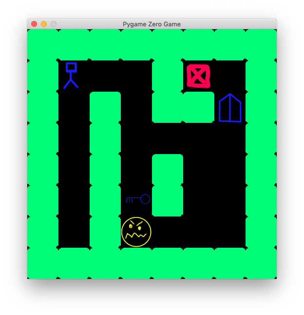
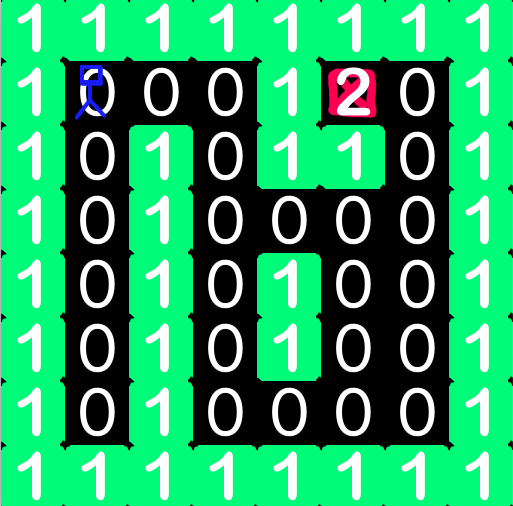

# Maze game
In this lecture we will build a maze game together, step by step. The Python we will use is quite simple: mostly just conditionals and loops. The technique of creating a tilemap is common in games and after seeing it here you should be able to incorporate it into your own projects.


## Tilemap
A tilemap uses a small number of images (the tiles) and draws them many times to build a much larger game level (the map). This saves you from creating a lot of artwork and makes it very easy to change the design of the level on a whim. Here we create a maze level.

We will find three image files for the tiles: empty.png, wall.png and goal.png.

They must each be 64×64 pixels. For the player we will use the built in alien image.

The filenames of the tile images are stored in a list, tiles. The level design is stored in a list of lists, more commonly called a two dimensional array. There are 8 rows and 8 columns in the array. If you change the size of the array you will need to change the WIDTH and HEIGHT values too. The numbers in the maze array refers to elements in the tiles array. So 0 means empty and 1 means wall, etc.



To draw the maze we use a for loop within another for loop. The outer loop iterates over the rows and the inner loop iterates over the columns, i.e. the elements of the row.

### The Maze array:
```python3
maze = [
    [1, 1, 1, 1, 1, 1, 1, 1],
    [1, 0, 0, 0, 1, 2, 0, 1],
    [1, 0, 1, 0, 1, 1, 0, 1],
    [1, 0, 1, 0, 0, 0, 0, 1],
    [1, 0, 1, 0, 1, 0, 0, 1],
    [1, 0, 1, 0, 1, 0, 0, 1],
    [1, 0, 1, 0, 0, 0, 0, 1],
    [1, 1, 1, 1, 1, 1, 1, 1]
]
```

### Define a constant TILE_SIZE
```python3
TILE_SIZE = 64
```
## Add player and moving the player
We need to add `alien` image as a player of our game. You can find that image in image folder. Don't forget to call `player.draw()` in draw function

```python3
player = Actor("alien", anchor=(0, 0), pos=(1 * TILE_SIZE, 1 * TILE_SIZE))
```

In order to move the player we need to create a fuction called `on_key_down`. This function will be called automatically by Pygame, like draw() and update(). However on_key_down() is not called every frame; it is only called when the player presses a key. The key that was pressed is passed to the function in the key parameter.

You need to define following variables for row and column
```python3
row = int(player.y / TILE_SIZE)
column = int(player.x / TILE_SIZE)
```
Then when you move with up and righ arrow you need to increate and descrese the the row. When you move right and left you need to increase the column. At the end you need to perform some calculation.

```
player.x = column * TILE_SIZE
player.y = row * TILE_SIZE
```

## Restricting where the player can move
Delete the last two lines of the function that we create in previus step. Then we need to restrict where we can move. The only possible possition is when the tile is empty. But the the tile is goal we need to quit the game. 

## Animate the movement of the player
First, the alien Actor is bit too big. Change it player.png in the images folder.

Next, the movement of the Actor is sudden and jerky. Luckily Pygame includes a function to do smooth movement for us automatically. Find these lines of the program:

`animate(player, duration=0.1, pos=(x, y))`