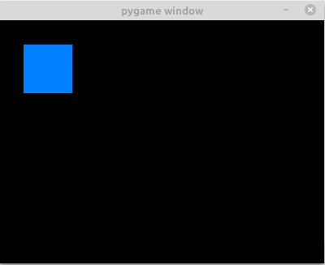

# Create a simple application with PyGame
### What is PyGame
- Pygame is a set of Python modules designed for writing video games. 
Pygame adds functionality on top of the excellent SDL library. 
This allows you to create fully featured games and multimedia programs 
in the python language.

- Pygame is highly portable and runs on nearly every platform 
and operating system.

- Pygame itself has been downloaded millions of times.

- Pygame is free. Released under the LGPL licence, you can create open source, 
freeware, shareware, and commercial games with it. See the licence for full details.

### Windows installation
Make sure you install python3.6 with the "Add python 3.6 to PATH" option selected. 
This means that python, and pip will work for you from the command line.

```shell script
py -m pip install -U pygame --user
```

### Setting Up the Game Loop
Every game from Pong to Fortnite uses a game loop to control gameplay. 
The game loop does four very important things:

- Processes user input
- Updates the state of all game objects
- Updates the display and audio output
- Maintains the speed of the game

Every cycle of the game loop is called a frame, and the quicker you can do things each cycle, the faster your game will run. Frames continue to occur until some condition to exit the game is met. 
In your design, there are two conditions that can end the game loop:

- The player win/loose the game.
- The player closes the window.

### The Anatomy of a PyGame Game

- **import pygame** - this is of course needed to access the PyGame framework.
- **pygame.init()** - This kicks things off. It initializes all the modules required for PyGame.
- **pygame.display.set_mode((width, height))** - This will launch a window of the desired size. The return value is a Surface object which is the object you will perform graphical operations on. This will be discussed later.
- **pygame.event.get()** - this empties the event queue. If you do not call this, the windows messages will start to pile up and your game will become unresponsive in the opinion of the operating system.
- **pygame.QUIT** - This is the event type that is fired when you click on the close button in the corner of the window.
- **pygame.display.flip()** - PyGame is double-buffered. This swaps the buffers. All you need to know is that this call is required in order for any updates that you make to the game screen to become visible.

### Drawing Something
**pygame.draw.rect** - As you can imagine, this will draw a rectangle. I takes in a few arguments, including the surface to draw on (I'll be drawing on the screen instance),
 the color, and the coordinates/dimensions of the rectangle.
```python3
# Add this somewhere after the event pumping and before the display.flip()
pygame.draw.rect(screen, (0, 128, 255), pygame.Rect(30, 30, 60, 60))
```


### Interactivity
The point of a game is to be interactive. 
Right now, the only thing you can interact with is the close button. Which isn't a very fun game. All user input events come through the event queue. 
Simply add more if statements to that for loop to add more interactivity.

Add the following code before the loop:
```python3
is_blue = True
```
Modify your rectangle code to pick a color conditionally:
```python3
if is_blue:
 color = (0, 128, 255)
else:
 color = (255, 100, 0)
pygame.draw.rect(screen, color, pygame.Rect(30, 30, 60, 60))
```
Finally, the important bit. Add the following if statement to your for 
loop in the same sequence as the other if statement in there...
```python3
if event.type == pygame.KEYDOWN and event.key == pygame.K_SPACE:
    is_blue = not is_blue
```
### Adventuring around
Let's create two variables right after is_blue variable 
```python3
x = 30
y = 30
```
Take with button is pressed
```python3
pressed = pygame.key.get_pressed()
```
Change the position of the rect regarding to the button
```python3
if pressed[pygame.K_UP]: y -= 3
```
Do the same for each arrow.
### OPS something is wrong 
- Each time you draw a rectangle, the rectangle from the previous frames remains on the screen.
- It moves really really really fast.

For the first, you simply need to reset the screen to black before you 
draw the rectangle. There is a simple method on Surface called fill that does this.
It takes in an rgb tuple.
```python3
screen.fill((0, 0, 0))
```


Secondly, the duration of each frame is as short as your super 
fancy computer can make it. 
The framerate needs to be throttled at a sane number such as 60 frames 
per second. Luckily, there is a simple class in pygame.time called 
Clock that does this for us. It has a method called tick which takes in a 
desired fps rate.

```python3
clock = pygame.time.Clock()

...
while not done:

    ...

    # will block execution until 1/60 seconds have passed
    # since the previous time clock.tick was called.
    clock.tick(60)
```