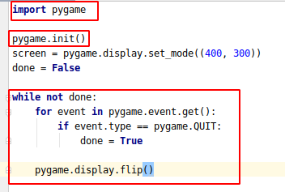

# Geometric Drawings
Lets start by initialize the pygame. If you don't remember how you can do that
please you following code snippet as a example.


## Drawing a rectangle
Please do not forget to define your color variable and positions variables as well.
```python3
pygame.draw.rect(screen, color, pygame.Rect(left, top, width, height))
```

## Drawing a circle
```python3
pygame.draw.circle(screen, color, (x, y), radius)
```

## Use previews two examples
On each method call from previous two examples pass one more params. For example 10
```python3
pygame.draw.circle(screen, color, (x, y), radius, 10)
```

## Drawing a line
```python3
pygame.draw.line(screen, color, (startX, startY), (endX, endY), width)
```

## Tasks
All question to the user need to be before game loop and via terminal
- [ ] Create a program that ask user for x and y and move the rectangle on those positions
- [ ] Create a program that ask user for RGB values and then create a circle with that color on position  x:30 and y:60
- [ ] Create a program that ask user for starting coordinates and ending coordinates, then create a line with color green and width 10
- [ ] Create a program that aks user for everything possible that PyGame will need to create a line with custom configuration

## Adding Images
To load an image from file, there is a simple call to pygame.image.load()
```python3
image = pygame.image.load('ball.png')
```
Now we load the image but we didn't display it to the scree. Now is the time to display it to the screen.

Add following code snippet to the program in game loop
```python3
screen.blit(image, (20, 20))
```
### Tasks 
- [ ] Do you remember on previous lecture we build the program that provide us a way to move the react with keyboards.
Now is the time to create the same with this ball. Please do not copy paste previous code.
- [ ] Create a program that first ask user for the name of the image and them load it.
