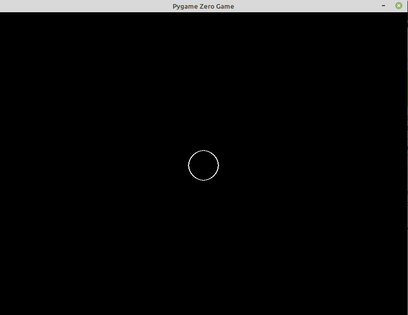
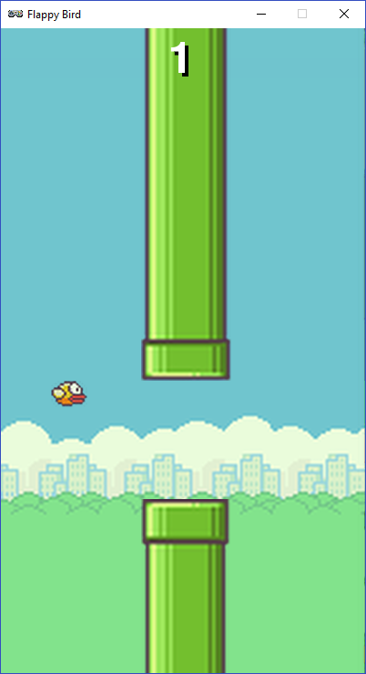
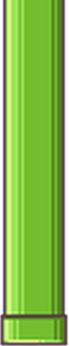
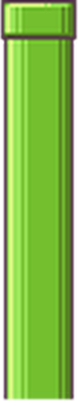

# Welcome to Pygame Zero
Pygame Zero is for creating games without boilerplate.
In last couple of lectures we learned library called `pygame`. So know we know how that
library works, so we can continue with `pygane zero`. 

Pygame Zero is a wrapper around Pygame, a popular Python game engine. 
The advantage of Pygame Zero is that it presents a very simple and streamlined interface, 
meaning it takes very little work to make complete games.

The features in Pygame Zero are very similar to those found in Scratch, 
and are designed for programmers with no experience in text-based coding.

PyGame zero is a wrapper of PyGame, so me can do everything possible with `pygame`, but 
without boilerplate code that just handle some `Event loop` and things like that.

## Create a first example with PyGame Zero
Open your favorite IDE (I hope this will be PyCharm) and type the following example
```python3
import pgzrun

WIDTH = 800
HEIGHT = 600

def draw():
    screen.clear()
    screen.draw.circle((400, 300), 30, 'white')


pgzrun.go()
```
As yoiu can see now we don't need to manage the `Event Loop`, because PyGame Zero will do that for us. 

The result is following: 


## Game Loop Hooks
Pygame Zero will automatically pick up and call event hooks that you define. 
This approach saves you from having to implement the event loop machinery yourself.

A typical game loop looks a bit like this:
```python3
while game_has_not_ended():
    process_input()
    update()
    draw()
```
For more information click here: [PyGame Zero Event Loop](https://pygame-zero.readthedocs.io/en/stable/hooks.html)

## Built-in Objects
Pygame Zero provides useful built-in objects to help you make games easily.
1) Screen `The screen object represents your game screen.`
2) Rect 
3) Resource Loading `The images and sounds objects can be used to load images and sounds from files stored in the images and sounds subdirectories respectively. Pygame Zero will handle loading of these resources on demand and will cache them to avoid reloading them.`
4) Music

For more information click here: [PyGame Zero Event Loop](https://pygame-zero.readthedocs.io/en/stable/builtins.html)

# Flappy Bird


Flappy Bird is a side-scrolling mobile game featuring 2D retro style graphics. 
The objective is to direct a flying bird, named "Faby", who moves continuously 
to the right, between sets of Mario-like pipes. If the player touches the pipes, 
they lose. Faby briefly flaps upward each time that the player taps the screen; 
if the screen is not tapped, Faby falls because of gravity; each pair of pipes that 
he navigates between earns the player a single point, with medals awarded for the score 
at the end of the game. No medal is awarded to scores less than ten. 
A bronze medal is given to scores between ten and twenty. In order to receive the 
silver medal, the player must reach twenty points. The gold medal is given to those 
who score at least thirty points. Players who achieve a score of forty or higher 
receive a platinum medal. 

## Getting Started
Create a directory called `flappybirdgame` and then create file called `flappy`.
```python3
import pgzrun

pgzrun.go()
```
This will just configure the PyGame Zero and all needed resources.
Name is the time to resize the windows and add title on that windows
```python3
TITLE = 'Flappy Bird'
WIDTH = 400
HEIGHT = 708
```
Please save the file and run it again. Now the title of Windows will be `Flappy Bird`.
## Drawing a Background
Inside the `flappybirdgame` folder, create another folder called `images` and add following
file as background


In order to add that background you need to define a function called **draw**. Add the snippet bellow before  `pgzrun.go()`
```python3
def draw():
    screen.blit('background', (0, 0))
```

## Adding a Bird
Actor is part of Pygame Zero, and represent own actor witch will do some things in our game.
You need to download that bird. Then using the Actor class we need to add it in our game.

Please add the following snipper right before `pgzrun.go()`.
```python3
barry_the_bird = Actor('bird1', (75, 350))
```
Now we load the bird actor in memory, so now is time to draw in on screen. We need to add one
additional line in **draw** function

```python3
barry_the_bird.draw()
```

## Making the Bird Move
Let’s make our bird respond to mouse input. Let’s add a new function. Functions can be in any order in the file,
 but a good place is just before the draw function.
```python3
def on_mouse_down():
    print ('The mouse was clicked')
    barry_the_bird.y -= 50
```
All Actors have x and y positions. Remember when we made Barry, 
we said `barry_the_bird = Actor...`, so that means he is an Actor!
x is the left/right position, and y is the up/down position. 
The last line of our new function is changing the y position of Barry.

The `on_mouse_down` function is called every time you click the mouse. Calling a function means doing the instructions it contains. 
If we want to make the bird move smoothly we need to move him in small amounts, 
and do it so often that it looks smooth.

## Gravity
We need to move our bird down to simulate the gravity. There is a function in PyGame Zero,
that is called 60 times per second and this function is called **update**.

Let’s add a new variable which controls the **speed** of the bird. 
Think about it like a slider we can change. 
We can actually put one variable inside another. **barry_the_bird** already has **x** and **y** variables inside him. 
We can add another one like this:

```python3
barry_the_bird.speed = 1
```
Then we need to define the **update** function.
```python3
def update():
    barry_the_bird.y += barry_the_bird.speed
```

## Challenges - Homework
- [ ] Make the bird move left, right and top with keyboard.
- [ ] Make it so that the bird stops moving if the player clicks anywhere. 
**Hint** : The code should change the value of speed when you click
- [ ] Make is so that when you hold the mouse button down the bird stops moving, but when you let it go it moves again.
 **Hint**: You will need to add a new function **called on_mouse_up**
 
 ## Adding the pipes
 You’ve already seen that we can create **Actor** objects and move these around the screen. 
 If you’ve forgotten, go and look at where you use **barry_the_bird** in your code to see how it works.
 
 So now is the time to download the pipes images
 
 #### Top pipe
 
 #### Botton pipe
 
 
 Let’s create two new actors, at the end of your code add:
 ```python3
top_pipe = Actor('top', (300,0))
bottom_pipe = Actor('bottom', (300,500))
```
Now we need to update the **draw** function.
```python3
top_pipe.draw()
bottom_pipe.draw()
```

## Mind the gap
Lets create the gap between top and bottom pipe. We can do that with gap variable 
and simple math operation

```python3
gap = 140
top_pipe = Actor('top', (300, 0))
bottom_pipe = Actor('bottom', (300, top_pipe.height + gap))
```
## Flying forwards
So let’s make the pipes move. Just as we did with our bird we can create a speed 
variable for the pipes and use this to move them. We want the following line of 
code to run once when we run the program, so it needs to go at the end of your code:
```python3
scroll_speed = 1
```
And they need to move continously, so this code goes in the update function:
```python3
top_pipe.x += scroll_speed
bottom_pipe.x += scroll_speed
```
