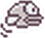

# Flappy Bird (Part 2)
## More pipes
We need more pipes, one set is not enough. But actually we have enough already, 
we can just loop them round when they go off the screen.
 
What do you think this code does? Open a new Mu script and type it in: 
```python3
a = 10
if a > 5:
    print("Wow a is big")
```

## Looping the pipes
OK, let’s get to work in the `update` function, as that’s where we move the pipes. 
Add this code to the end of the function, and make sure you indent it 
(add spaces to the beginning of the line) so that it really is inside the function. 
```python3
if top_pipe.x < 0:
    top_pipe.x = WIDTH
```
OK, that’s not bad, but two problems…

-[ ] Only the top pipe moves

## Flying back to the start
What happens when Barry falls off the bottom of the screen? Right now you probably lose him forever.
 Let’s try to do something better.

Add this new function after the `on_mouse_down` function:
```python3
def reset():
    print ("Back to the start...")
    barry_the_bird.speed = 1
    barry_the_bird.center = (75, 350)
    top_pipe.center = (300, 0)
    bottom_pipe.center = (300, top_pipe.height + gap)
```
Add this to the end of the `update` function:
```python3
if barry_the_bird.y > HEIGHT:
    reset()
```
We also need to reset the game if Barry goes off the top of the screen.
- [ ] Change your code to make this happen.

## Time to Flap!
At the moment, Barry the bird seems to teleport upwards 
when you click the screen (play the game now if you don’t remember). 
We’d really like him to move a bit more smoothly. The reason he seems to 
move instantaneosly is this line:

```python3
barry_the_bird.y -= 50
```
This makes him move a whole 50 pixels all at once. Not very smooth! 
When a real bird flaps its wings it changes the bird’s speed, not its position. 
Change in position is just a side effect of having speed.

Change your on_mouse_down function to this:
```python3
def on_mouse_down():
    barry_the_bird.speed = -6.5
```
Create a variable called gravity at the end of your file:
```python3
gravity = 0.3
```
Add this to the beginning of the update function:
```python3
barry_the_bird.speed += gravity
```

## Giving Barry a head start
Let’s give the player a bit more time to flap before they fall off the screen. 
We can move the start point to just 50 pixels away from the top of the screen. 
Find this line in the `reset` function:
```python3
barry_the_bird.center = (75, 350)
```
## Collisions
In PyGameZero there’s nothing to stop you drawing multiple sprites (images) on top of each other. 
So if we want certain behaviour when things collide we need to take care of it ourselves. 
Add this code to the end of the `update` function:

```python3
if (barry_the_bird.colliderect(top_pipe)):
    hit_pipe()
```

The `colliderect` function checks if two objects are touching. 
Because this is inside the update function it will get checked every frame. 
This won’t work yet because we haven’t created the `hit_pipe` function. 
Let’s create it after the `reset` function…
```python3
def hit_pipe():
    print ("Hit pipe!")
    barry_the_bird.image = "birddead"
```


Try this out. Now Barry should become a ghost when you hit the top pipe, 
but it looks like there are still three problems:

1. Barry stays as a ghost even when the game resets.
2. Barry can still fly through the bottom pipe!
3. You can still flap and fly along even as a ghost.

Try to fix problems 1 & 2 now. We’ll look at 3 together.

**Hint for number 1** : Barry started with the “bird1” image, 
but it changes to “birddead” when he hits a pipe. 
Find the right place to change it back.

**Hint for number 2** : Remember the `or` keyword.

We’re creating the new variable alive and setting it to true. 
Now we need to make sure barry only flaps when he’s alive.
```python3
barry_the_bird.alive = True
```
Add this line to the beginning of the `on_mouse_down` function:
```python3
if (barry_the_bird.alive):
```
Don’t forget to change the indentation (number of spaces at the beginning) 
of the line that changes the speed, so that it’s part of the if statement. 
We only want to change the speed (in other words flap) if the bird is alive!

Add a line to change barry’s `alive` variable to `False` when he hits a pipe.

## Keeping Score!
Add the following code to the end of your draw function:
```python3
screen.draw.text(
    str(7),
    color='white',
    midtop =(20, 10),
    fontsize=70,
    )
```
## Let’s get to the point
A number which always stays the same isn’t very helpful! 
We need to make this number get bigger as the player goes past pipes. 
Let’s add another variable to Barry to keep track of the score.

Add this to the bottom of the file:
```python3
barry_the_bird.score = 0
```

Now let’s add some code to increment (add 1 to) the score when we go past a pipe.
Add this to the end of the `update` function:
```python3
if top_pipe.right < barry_the_bird.x:
    barry_the_bird.score += 1
```
Change the call to the `screen.draw.text` function in your 
draw function so that it uses the score variable.

## Add comments to the program
In every place when we you thing is good to add comments add them.
