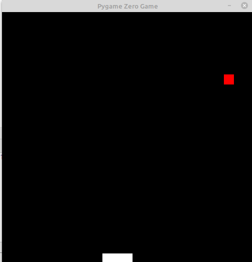

# PING PONG
Today we are going to build a game that is called "ping pong". You can see the preview of the game bellow



## Initialize
The first task when we start want to build the game is to create file called `pong.py`.
Then you need to import the `pgzrun` and at the end of the file to call `pgzrun.go()`
- [ ] If you do the steps correctly you must visit big black window on your screen
- [ ] Change the window size to have 500 for **WIDTH** and 500 for **HEIGHT**
- [ ] Create a variable ball of type **Rect**. `Rect((150, 400), (20, 20))`
- [ ] Create a variable bat of type **Rect** `Rect((200, 480), (60, 20))`
- [ ] Create two variables vx and vy. Both of them need to 4 as a value
- [ ] Define function called `draw`.
   ```python3
    screen.clear()
    screen.draw.filled_rect(ball, "red")
    screen.draw.filled_rect(bat, "white")
  ```  
## Move bat with keyboards 
We will control the bat with our keyboard, so we need to be able to do
 something when left and  right key are pressed.
- [ ] Define function called `update`
- [ ] Create if and add following fragment their
    ```python3
     if(keyboard.right):
        print("Right key pressed")  
    ```
  Now when you pressed the right button you need to have message in your console
- [ ] Do the same step but for `left` key
- [ ] For the right one add `bat.x += 2`
- [ ] For the right one add `bat.x -= 2`

If everything is fine your will be able to manipulate the bat with keyboards

## The global Keyword
Normally, when you create a variable inside a function, that variable is local, 
and can only be used inside that function.  
1. To create a global variable inside a function, you can use the `global` keyword.
2. Also, use the `global` keyword if you want to change a global variable inside a function.

## Move ball
In the `update` function you need to use global keyword as following
```python3
    global vx, vy
```
- [ ] Change ball.x variable with value of vx
- [ ] Change ball.y variable with value of vy

## Collisions with edges and ball
- [ ] First we will check the collisions with left and right edge
    ```python3
        if ball.right > WIDTH or ball.left < 0:
            vx = -vx
    ```
- [ ] Then we to handle collisions with top and ball
    ```python3
        if ball.colliderect(bat) or ball.top < 0:
            vy = -vy
    ```
## Exit the game
The game need to exist when the ball is under the bat. You need to do 
with extra if and checking for `ball.bottom > HEIGHT`, if that expresion return 
true just call `exit()` function  

### Extra tasks
- [ ] Create scores, when the the ball touch the bat we need to increase the score
- [ ] Create lives. You will have 3 lives, at the end show the max result for your game
- [ ] Create the game multi player add one more bat and control it with `w` and `s`
